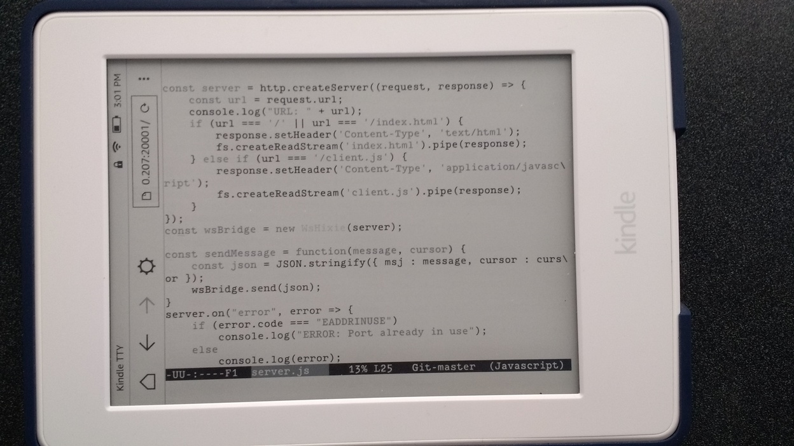

# kindle-tty

Wouldn't it be cool to program on an e-ink device, like the kindle? Well, maybe not with the limited processing power of the kindle, but rather use it just as a screen? That is the purpose of this project! The refresh rate is not very good, but so far seems usable.

**Note**: This is part of my personal trinkets, most probably it needs some tweaking before you can use it.
Currently I'm using a Kindle Paperwhite with firmware 5.9.4

The experimental browser on the Kindle is quite cool, it supports some modern features! Of special interest, is the WebSocket support! As it would allow me to keep an open connection, and sync it live!

## How do I run it?
1) I usually set a tmux session on my computer, and my current approach to have a matching "terminal size", I use the tmux panes. Basically divide the screen on 3 panes, and resize-pane so that one ends with 63 $COLUMNS * 28 $LINES

2) cd <project-root>

Just for the very first time  
3) mkfifo bridge

4) node server.js

Now on the "63*28 pane":  
5) script -f <project-root>/bridge

6) Then open http://<ip-machine>:20001/ on the kindle  
And start typing on the "63*28 pane"!

**Warning** I'm still figuring out the best way to use the named pipe (mkfifo). It's quite picky. If you run "script" without having the node listener, it would seem that the terminal hangs (as it is waiting for readers). Also, if node crashes, it seems it will terminate the subshell started by the script command.
